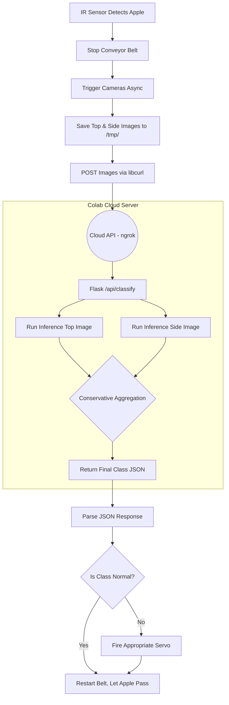

# 🏛 System Architecture

The Apple Sorting System is a hybrid edge-cloud application.

## High Level Workflow

## AI Model Details
- **Model**: Vision Transformer (ViT) - `vit_base_patch16_224`
- **Library**: `timm` (PyTorch Image Models)
- **Optimizer**: AdamW
- **Scheduler**: CosineAnnealingLR
- **Loss Function**: Weighted CrossEntropyLoss with label smoothing to handle dataset imbalances.

## Aggregation Logic
Because the system captures two views of the same apple, it must reconcile potentially different predictions:
- **Conservative Aggregation**: If *either* camera detects a disease (Blotch, Rot, or Scab), the apple is marked as diseased. Both cameras must predict "Normal" for the apple to pass.
- **Confidence Threshold**: If the model confidence is below 0.50, the object is rejected as a non-apple or unknown anomaly.
